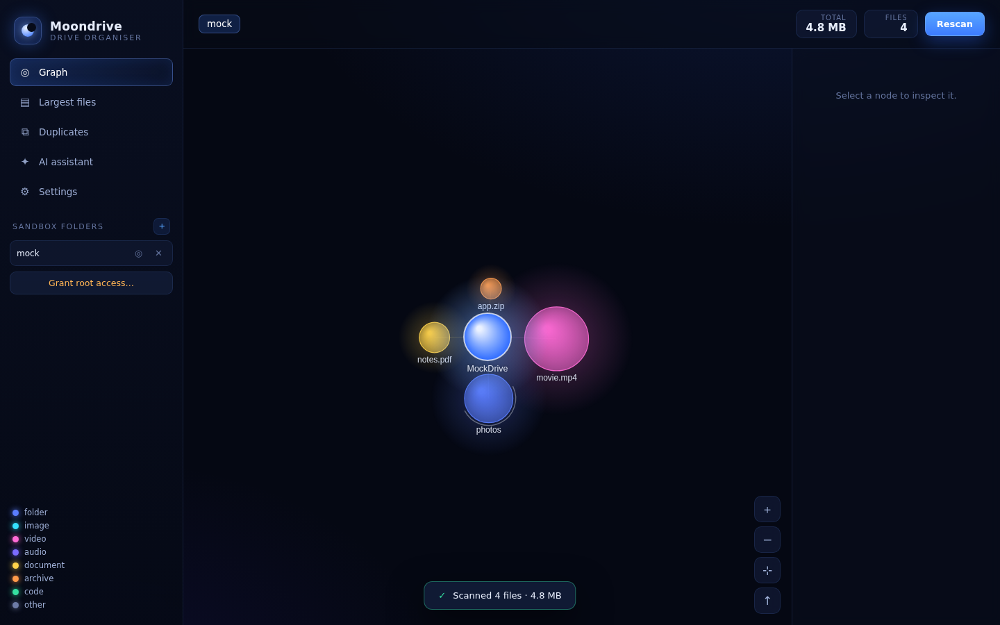

# 🌙 Moondrive

A modern, sandboxed **drive organiser** built with Electron. Scan your disks,
watch your files bloom into a navigable **node graph** sized by weight and
coloured by type, then declutter with confidence — with a **Gemini AI**
assistant advising you on what to keep, archive, or delete.

Black-and-blue dashboard, smooth animations, and safety-first deletions (every
removal goes to your system Trash, never a hard delete).



---

## Features

- **📊 Node-graph visualiser** — a live, force-directed galaxy of your files.
  Nodes are sized by byte-weight and coloured by category (video, image, audio,
  documents, code, archives, executables…). Pan, zoom, drag nodes, and
  **double-click a folder to drill into it**; breadcrumbs let you jump back out.
- **🔍 Deep recursive scanner** — streams live progress (files, folders, size),
  handles permission errors gracefully, and skips symlinks by default to avoid
  loops.
- **🗂 Largest files & duplicate finder** — instantly surface the biggest space
  hogs, and detect duplicate files (grouped by size + content fingerprint) with
  a one-click "reclaimable space" estimate.
- **🤖 Gemini AI assistant** — chat with Google's Gemini about how to organise
  your drive. It sees only *aggregate* stats and the *names* of your largest
  items — **never file contents**.
- **🛡 Sandboxed by design** — Moondrive can only read or modify folders you
  explicitly grant. There's an optional, clearly-warned "grant root access" for
  power users. Every filesystem mutation passes through a single allow-list gate
  in the main process.
- **🗑 Safe deletions** — files are moved to the system Trash (restorable), with
  a confirmation step and multi-select trashing from the lists.
- **🎨 Modern UI** — black/blue glassy dashboard, glowing nodes, fluid
  transitions, toasts, and a keyboard-friendly modal system.

## Architecture

```
src/
├── main/                 Electron main process (Node — full filesystem access)
│   ├── main.js           App lifecycle + all IPC handlers (sandbox-gated)
│   ├── scanner.js        Recursive, cancellable scan + duplicate detection
│   ├── gemini.js         Minimal Gemini REST client + privacy-safe summariser
│   └── store.js          Local JSON settings + the sandbox allow-list gate
├── preload/
│   └── preload.js        contextBridge — the only surface the UI can touch
└── renderer/             Sandboxed UI (no Node access)
    ├── index.html        Dashboard layout
    ├── styles.css        Black & blue theme + animations
    ├── graph.js          Canvas force-directed node graph (MoonGraph)
    └── renderer.js        App logic, views, navigation, AI chat
```

### Security model

- `contextIsolation: true`, `nodeIntegration: false` — the renderer has **no**
  direct access to `fs`, `path`, or Node. It talks to the main process only
  through the narrow `window.moondrive` API defined in the preload.
- Every filesystem-mutating IPC handler re-validates its target against the
  sandbox allow-list (`Store.isPathAllowed`), which correctly rejects
  sibling-prefix tricks (e.g. `/data-evil` is **not** inside `/data`).
- Deletions use Electron's `shell.trashItem` — items go to the OS Trash and can
  be restored.
- A strict Content-Security-Policy is set on the renderer document.

## Getting started

```bash
npm install     # installs Electron
npm start       # launch the app
npm run dev     # launch with DevTools open
```

> **Note:** `npm install` downloads the Electron binary from GitHub releases.
> In network-restricted environments that download may be blocked; run it on a
> machine with normal outbound access.

### Using the AI assistant

1. Get a free API key from [Google AI Studio](https://aistudio.google.com/apikey).
2. Open **Settings → Gemini AI**, paste your key, pick a model, and save.
3. Head to **AI assistant** and ask away.

### Packaging

```bash
npm run pack    # unpacked build in release/
npm run dist    # installable build (AppImage / NSIS / dmg) via electron-builder
```

## How the graph works

Each scanned folder becomes a central **hub**; its children orbit it as glowing
nodes. Node radius scales with `√(size)` so both huge and tiny items stay
visible, and colour encodes the file category. A lightweight physics loop
(gravity + pairwise repulsion + collision separation) keeps the layout tidy and
alive. When a folder has hundreds of children, the long tail is bundled into a
single "+N smaller items" node you can expand.

## Privacy

Moondrive runs entirely on your machine. The only network calls it makes are to
Google's Gemini API — and only when you use the assistant, sending only
aggregate statistics and file/folder **names**, never contents. Your API key and
granted-folder list are stored in a local JSON settings file.

## License

MIT
